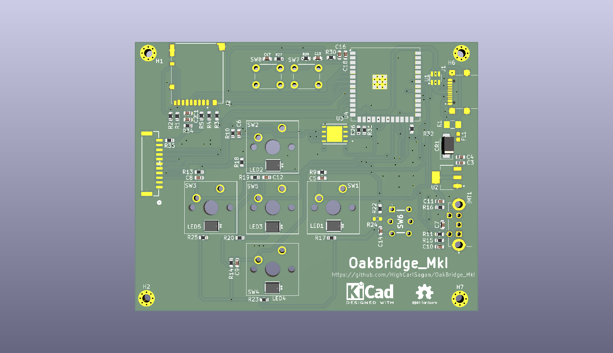
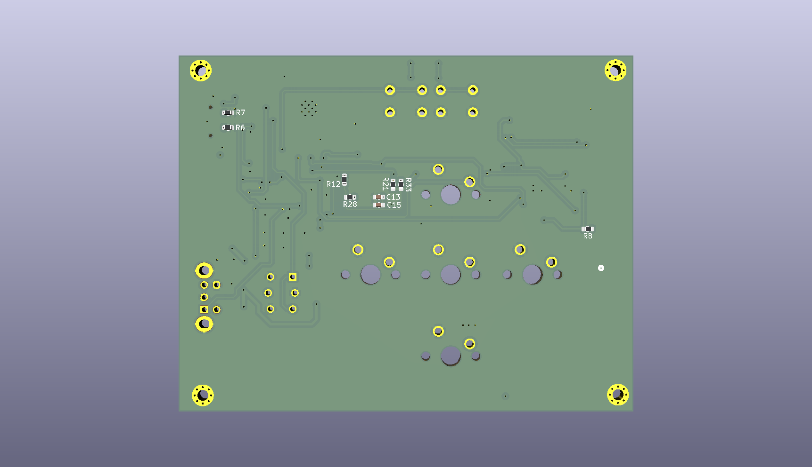

# OakBridge MkI

**A tactile PC dashboard — ESP32-S3, mechanical keys, IPS display, and a wooden enclosure.**

[](#roadmap)
[](LICENSE)
[](https://www.kicad.org/)
[](https://docs.espressif.com/projects/esp-idf/)
[](https://www.oshwa.org/)

<p align="center">
  
  &nbsp;
  
</p>

---

## Why I Built This

I spend a lot of my day staring at terminals and dashboards. I wanted a small, tactile thing on the desk that could show me what my PC was doing without me having to alt-tab to find out — CPU temp during a long compile, what's playing on Spotify, calendar at a glance — and let me poke at it with real keys instead of yet another window.

The other half of the motivation is the stretch. OakBridge is the first project where I deliberately scoped a hardware → firmware → host-software stack end-to-end, all on parts I hadn't used in anger before: ESP32-S3, LVGL on a real display, FRAM for state, and a Python companion talking over MQTT. The point is to do the whole loop once, badly, and have a tangible thing on the desk afterwards.

The name is a nod to **oak wood** (the planned enclosure) and a small shout-out to **Oak Ridge National Laboratory**.

---

## Initial Requirements

The table below tracks the design intent against what will ship on **v1.1** (the DRC-fixed respin currently in fab, expected back end of May 2026). The first soldered board — **v1.0** — never powered up; see [Lessons Learned](#lessons-learned-the-0mm-via-incident) for the story. Until v1.1 lands, all power-up-dependent outcomes are honestly marked **TBD**.

| # | Requirement | Target | Outcome (v1.1) |
|---|---|---|---|
| 1 | MCU with WiFi + BLE + USB + enough headroom for LVGL | ESP32-S3 class | ✅ ESP32-S3-WROOM-1-N16R8 (16 MB flash, 8 MB PSRAM) |
| 2 | Display | ≥3" IPS, ≥320×240, SPI | ✅ Waveshare 3.5" IPS 320×480 (touch fanned out but unused in MkI) |
| 3 | Tactile input | Real mechanical keys with backlighting | ✅ 5× Cherry MX2A-E1NA + per-key backlight LEDs |
| 4 | Analog input | Rotary encoder with push | ✅ CUI ACZ11 (12 PPR, integrated switch) |
| 5 | Non-volatile state across reboots | FRAM, ≥1 Mbit | ✅ MB85RS4MTYPN (4 Mbit SPI FRAM) |
| 6 | Local storage for assets / logs | MicroSD socket | ✅ Hirose DM3BT push-push socket |
| 7 | Single-cable host connection | USB-C, power + serial | ✅ USB-C 2.0 + CDC-ACM virtual COM |
| 8 | Front-end protection | ESD + reverse-polarity + EMI filtering + fuse | ✅ USBLC6-2SC6 + SS14 + BLM18PG600 + 1.5A fuse |
| 9 | Power | USB 5V in, single 3.3V rail | ✅ TLV1117LV33 LDO (1A capacity, ~400 mA budget) |
| 10 | Board size | Comfortably hand-held footprint | ✅ 92 × 70 mm, 2-layer FR-4 |
| 11 | Manufacturability | Common SMD, hand-solderable | ✅ 0603 passives, QFN regulator, through-hole switches |
| 12 | Power-on bring-up | All rails verified | ⏳ TBD (waiting on v1.1) |
| 13 | Display, switches, encoder, FRAM verified | Hardware sign-off | ⏳ TBD |
| 14 | Firmware: LVGL, MQTT, OTA, mDNS | End-to-end on real board | ⏳ TBD |
| 15 | Wooden enclosure | Oak / walnut, parametric CAD | 🔄 In progress, on backburner |

---

## Specifications

| | |
|---|---|
| **MCU** | Espressif ESP32-S3-WROOM-1-N16R8 (Xtensa LX7 dual-core, 16 MB flash, 8 MB PSRAM) |
| **Display** | Waveshare 3.5" IPS, 320 × 480, SPI (touch fanned out, not wired up in firmware) |
| **Keys** | 5 × Cherry MX2A-E1NA, per-key blue backlight (Cree JE2835) |
| **Encoder** | CUI ACZ11BR1E-15KQA1-12C, 12 PPR with push |
| **NV storage** | MB85RS4MTYPN — 4 Mbit SPI FRAM |
| **Removable storage** | Hirose DM3BT-DSF-PEJS — push-push microSD socket |
| **Host interface** | USB-C 2.0, power + CDC-ACM serial |
| **Front-end protection** | 1.5 A fuse → SS14 reverse-polarity Schottky → BLM18PG600 ferrite → USBLC6-2SC6 ESD array |
| **Regulator** | TI TLV1117LV33 — 3.3 V LDO, 1 A capacity |
| **Power budget** | ~400 mA typical (estimate; bring-up will measure) |
| **PCB** | 92 × 70 mm, 2-layer FR-4, 1.6 mm, 1 oz copper, ENIG |
| **Aux switches** | BOOT + EN (ESP32 strap-pull), one extra tactile for firmware-defined use |
| **Mounting** | 4 × M3 holes (H1, H2, H6, H7) |

---

## Architecture

```
                ┌──────────────────────────────────────────────┐
                │                  USB-C (J1)                  │
                │      5 V power + USB 2.0 (D+ / D−)           │
                └──────────────────┬───────────────────────────┘
                                   │
                          ┌────────┴───────────────┐
                          │  Protection front-end  │
                          │  Fuse → SS14 → Ferrite │
                          │     → USBLC6 ESD       │
                          └────────┬───────────────┘
                                   │ 5 V
                          ┌────────┴────────┐
                          │   TLV1117LV33   │
                          │   5 V → 3.3 V   │
                          └────────┬────────┘
                                   │ 3.3 V (1 A)
                                   │
        ┌──────────────────────────┼──────────────────────────┐
        │                          │                          │
        ▼                          ▼                          ▼
┌────────────────┐       ┌─────────────────────┐    ┌───────────────────┐
│ ESP32-S3 N16R8 │       │  Waveshare 3.5" IPS │    │  MB85RS4MTYPN     │
│  WiFi + BLE    │◀─────▶│   320×480, SPI      │    │  4 Mbit SPI FRAM  │
│  USB-OTG       │       │   JST-GH 11-pin (J4)│    │   (state, config) │
└───┬────────┬───┘       └─────────────────────┘    └───────────────────┘
    │        │
    │        │            ┌──────────────────────┐
    │        ├──────────▶ │  microSD (DM3BT, J2) │
    │        │            │  logs, assets        │
    │        │            └──────────────────────┘
    │        │
    │        │            ┌──────────────────────┐
    │        └──────────▶ │  5 × Cherry MX2A     │
    │                     │  + 5 × backlight LEDs│
    │                     │  + CUI ACZ11 encoder │
    │                     │  + BOOT / EN / aux   │
    │                     └──────────────────────┘
    │
    ▼   (over WiFi)
┌──────────────────────────────┐
│  PC companion (Python)       │
│  CPU / GPU / RAM / media     │
│  → MQTT broker → OakBridge   │
└──────────────────────────────┘
```

---

## Why X over Y

A handful of decisions on this board that had real alternatives. Capturing them here so future-me remembers the trade.

**ESP32-S3 over ESP32 / RP2040.** The S3 has native USB (no CH340), enough SRAM + PSRAM to make LVGL pleasant, hardware vector ops, and WiFi + BLE on-chip. RP2040 would have been cheaper and easier to program but every wireless feature would have become a bolt-on. ESP32 (original) lacks native USB and is starting to feel its age for new designs.

**FRAM over EEPROM or flash-only.** State on this board (last screen, brightness, key bindings, MQTT credentials) gets written often enough that flash endurance is a real concern, and EEPROM is too small / too slow for anything beyond a few config bytes. FRAM is essentially RAM-fast, byte-writable, and rated for 10¹³ writes. Worth the few extra dollars.

**MicroSD + FRAM, not just FRAM.** FRAM holds *state*; SD holds *content* (UI assets, fonts, logs, image slideshow). Different access patterns, different lifetimes, different sizes. Keeping them separate keeps the firmware honest about what's small-and-precious vs. large-and-replaceable.

**TLV1117LV33 LDO over a buck.** Total budget is ~400 mA at 3.3 V from a 5 V source. Worst-case dissipation is (5 − 3.3) × 0.4 ≈ 0.7 W — comfortable for a SOT-223 with a copper pour. A buck would have been ~10–15% more efficient at the cost of switching noise on the analog encoder input, a bigger BOM, and an inductor. Not worth it at this current.

**2-layer board, not 4-layer.** Cheap to fab and the signal count is low enough to route on two layers without pain. The trade I made — and paid for — was that USB differential routing on a 2-layer stackup is fussier than I respected. See [Lessons Learned](#lessons-learned-the-0mm-via-incident). MkII may go 4-layer just for the routing comfort, not because anything on this board needs it electrically.

**Cherry MX2A over original MX.** The MX2A generation has smoother factory lubing and a quieter sound profile, and the footprint is drop-in compatible with classic MX. Same keycap ecosystem, slightly nicer feel.

**Touch fanned out but unused.** The Waveshare 3.5" comes with capacitive touch on the same FPC. I fanned the touch lines out to the connector but didn't wire them into firmware for MkI. Wanted to keep the firmware scope tractable; physical keys are the primary interaction. Touch becomes a v2 / MkII concern.

---

## Key Components

| Ref | Part | Function |
|---|---|---|
| U4 | ESP32-S3-WROOM-1-N16R8 | MCU + WiFi/BLE module |
| U3 | MB85RS4MTYPN-GS | 4 Mbit SPI FRAM |
| U2 | TLV1117LV33DCYR | 3.3 V / 1 A LDO |
| U1 | USBLC6-2SC6 | USB ESD protection array |
| J1 | GSB1C41110SSHR | USB Type-C 2.0 receptacle (Amphenol) |
| J2 | DM3BT-DSF-PEJS | Push-push microSD socket (Hirose) |
| J4 | BM11B-GHS-TBT | JST GH 11-pin (display FPC fanout) |
| MT1 | ACZ11BR1E-15KQA1-12C | CUI rotary encoder, 12 PPR + push |
| SW1–SW5 | Cherry MX2A-E1NA | Mechanical key switches |
| SW6 | TL1240YQ2JBLK | Auxiliary tactile (firmware-defined) |
| SW7, SW8 | SW_Push (THT) | ESP32 BOOT and EN |
| LED1–LED5 | Cree JE2835ARY-N | Per-key backlight (blue) |
| CR1 | SS14 | Schottky reverse-polarity protection |
| F1 | 1.5 A fuse (C1Q-series) | Input over-current |
| FL1 | BLM18PG600SN1D | EMI ferrite bead |
| R6, R7 | 5.1 kΩ | USB-C CC pull-downs (UFP role) |
| R30, R33–R35 | 0 Ω | Config straps (boot mode / interface selection) |

Full BOM: [`hardware/PC_Interface_Card/Exports/PC_Interface_Card.csv`](hardware/PC_Interface_Card/Exports/PC_Interface_Card.csv)
Netlist: [`hardware/PC_Interface_Card/Exports/PC_Interface_Card.net`](hardware/PC_Interface_Card/Exports/PC_Interface_Card.net)

---

## Connector Pinout

| Connector | Type | Purpose |
|---|---|---|
| J1 — USB-C | Amphenol GSB1C41110SSHR | 5 V power in + USB 2.0 data (UFP, CC pull-downs to GND via 5.1 kΩ) |
| J2 — microSD | Hirose DM3BT push-push | SPI to ESP32 (CD line wired) |
| J4 — Display | JST GH 11-pin | SPI MOSI/SCLK + DC/CS/RST + backlight enable + touch (unused) |
| MT1 — Encoder | Through-hole | A / B / SW pins (pull-ups on host side) |
| H1 / H2 / H6 / H7 | M3 mounting | Mechanical only |

Detailed pin-by-pin mapping will live in [`docs/pinout.md`](docs/pinout.md) once firmware development starts and pin assignments are locked.

---

## Firmware

**Status: not started.** Waiting for v1.1 boards to arrive before writing a single line. The plan below is the design intent, not a description of code that exists.

**Framework:** ESP-IDF v5.x
**Location:** `firmware/` (currently empty)

**Planned scope:**

- **Display:** LVGL on top of the Waveshare SPI driver, double-buffered, target 30+ FPS on simple screens.
- **Input:** software-debounced switches; quadrature decode for the encoder; long-press / multi-press detection.
- **Storage:** FRAM holds runtime config (brightness, current screen, key bindings, MQTT credentials). microSD holds fonts, icons, and any image assets.
- **Connectivity:** WiFi station mode, mDNS responder as `oakbridge.local`, MQTT client to a user-configured broker, embedded HTTP config server, OTA over WiFi.
- **PC link:** MQTT topics — `oakbridge/stats` (incoming PC metrics), `oakbridge/media` (now-playing), `oakbridge/commands` (outgoing key/encoder events). QoS 1.

Firmware build and flash instructions will land in [`docs/firmware_guide.md`](docs/firmware_guide.md) (planned).

### PC Companion

**Status: placeholder.** No code yet. The repo has a `companion/` directory reserved for it.

**Plan:** Python 3.8+ daemon that collects CPU / GPU / RAM / temperature stats via `psutil` and `pynvml`, reads media-player state via MPRIS on Linux, and publishes everything to MQTT for OakBridge to render. Linux first (my daily driver); Windows / macOS later if there's appetite.

---

## Setup & Bring-up

(Filled in after v1.1 boards arrive and bring-up completes.)

**Planned bring-up sequence:**

| Step | Action | Pass criterion |
|---|---|---|
| 1 | Power on via USB-C, no MCU loaded | 3.3 V rail measures 3.27–3.33 V, no thermal events |
| 2 | Probe ESP32 strap pins at reset | BOOT/EN behave correctly, no unexpected boot mode |
| 3 | Flash a minimal "hello UART" firmware | CDC-ACM enumerates, serial output visible |
| 4 | LED smoke test | Each of LED1–LED5 lights when driven |
| 5 | Switch + encoder smoke test | All 5 MX keys + encoder A/B/SW register |
| 6 | FRAM read/write test | Known-pattern write → power cycle → read back matches |
| 7 | microSD enumerate + read | FAT32 mount succeeds, files listable |
| 8 | Display init | Waveshare 3.5" shows colour bars |
| 9 | LVGL "hello" screen | First UI screen renders, encoder navigates |
| 10 | WiFi join + MQTT publish loop | `oakbridge/heartbeat` visible on broker |

Empty results table for backfill once boards arrive:

| Step | Result | Date | Notes |
|---|---|---|---|
| 1 | TBD | | |
| 2 | TBD | | |
| 3 | TBD | | |
| 4 | TBD | | |
| 5 | TBD | | |
| 6 | TBD | | |
| 7 | TBD | | |
| 8 | TBD | | |
| 9 | TBD | | |
| 10 | TBD | | |

---

## Hardware

**KiCad project:** [`hardware/PC_Interface_Card/`](hardware/PC_Interface_Card/) (KiCad 9.0)
**Schematic PDF:** [`hardware/docs/schematic.pdf`](hardware/docs/schematic.pdf)
**Gerbers:** [`hardware/PC_Interface_Card/Exports/Gerbers/`](hardware/PC_Interface_Card/Exports/Gerbers/) (v1.1, planned for end-of-May 2026)
**BOM:** [`hardware/PC_Interface_Card/Exports/PC_Interface_Card.csv`](hardware/PC_Interface_Card/Exports/PC_Interface_Card.csv)

### PCB Specifications

- **Size:** 92 × 70 mm
- **Layers:** 2-layer FR-4, 1.6 mm
- **Copper:** 1 oz (35 µm) outer
- **Finish:** ENIG
- **Min trace / clearance:** 0.15 mm / 0.15 mm (6 mil / 6 mil)
- **USB differential pair:** 0.35 mm width, 0.15 mm gap, target 90 Ω
- **Vias (v1.1):** 0.6 mm pad / 0.3 mm drill (signal); 0.8 mm / 0.4 mm (power)
- **Stitching:** ~50 GND vias

Design rule references:
- [`hardware/docs/pcb_design_rules.md`](hardware/docs/pcb_design_rules.md)
- [`hardware/docs/usb_routing_quick_ref.txt`](hardware/docs/usb_routing_quick_ref.txt)
- [`hardware/docs/kicad_design_rules.json`](hardware/docs/kicad_design_rules.json)

### Enclosure

A wooden enclosure (oak) is planned. CAD work is in progress and on the backburner while the v1.1 PCB respin and firmware bring-up take priority. Parametric files will land in [`enclosure/`](enclosure/) once the design is ready.

---

## Lessons Learned: the 0mm-via incident

The v1.0 board does not work. It does not even power up — I haven't tried, because the failure is structural, not electrical.

**What happened.** When I set up the PCB design rules in KiCad, I left the **via drill diameter at 0 mm** in one of the via classes. KiCad's DRC would have caught this immediately. I skipped DRC verification before exporting Gerbers, because the layout was "obviously fine" — I had reviewed it visually and the renders looked clean. The fab took the files as-is, produced the board with pads where vias should have been, and shipped it. I soldered the whole thing before realising every via on the affected net class was just a copper dot with no hole through the board.

**What I'm doing about it.**

1. **v1.1 is in fab.** Same design, drill diameters corrected, going turnkey this time so I get a populated board back. Expected end of May 2026.
2. **DRC is no longer optional.** From now on, "DRC pass" is a step in my export checklist that has to be ticked before Gerbers leave my machine. I've added a one-line note to my KiCad project template.
3. **I review fab DFM reports.** Most fabs *do* run DFM checks and flag missing drills. This one didn't, or did and I missed the email. Either way, the responsibility is on me to verify, not on them to warn.

**Why this is in the README and not buried.** The whole point of these write-ups is to be honest about how the work actually went. The board is broken because I made an avoidable mistake. Documenting it costs me nothing and saves the next person (probably future-me, on a different project) from doing the same thing. It also makes everything *else* in this README more credible.

More detail in [`docs/lessons-learned.md`](docs/lessons-learned.md).

---

## Repository Structure

```
OakBridge_MkI/
├── hardware/
│   ├── PC_Interface_Card/         # KiCad 9.0 project
│   │   ├── PC_Interface_Card.kicad_pro
│   │   ├── PC_Interface_Card.kicad_sch
│   │   ├── PC_Interface_Card.kicad_pcb
│   │   ├── Libraries/             # Custom symbols + footprints
│   │   └── Exports/
│   │       ├── Gerbers/
│   │       ├── PC_Interface_Card.csv     # BOM
│   │       ├── PC_Interface_Card.net     # Netlist
│   │       ├── PC_Interface_Card_Top.jpg
│   │       └── PC_Interface_Card_Bot.jpg
│   └── docs/
│       ├── schematic.pdf
│       ├── pcb_design_rules.md
│       ├── usb_routing_quick_ref.txt
│       └── kicad_design_rules.json
├── firmware/                      # ESP-IDF project (planned)
├── companion/                     # Python PC companion (placeholder)
├── enclosure/                     # Oak enclosure CAD (in progress)
├── docs/
│   ├── lessons-learned.md
│   ├── firmware_guide.md          # planned
│   ├── pinout.md                  # planned
│   └── images/
├── LICENSE
└── README.md
```

---

## When to Use This / When NOT to Use This

**Use this if you want to:**
- Build a tactile, mechanical-key dashboard for your own PC, on your own desk, with your own UI.
- Learn ESP32-S3, LVGL, FRAM, and MQTT together on one small board.
- Fork the design as a starting point for any "small wireless gadget with a screen and a few buttons" project.

**Don't use this if you want to:**
- A polished, validated, production-ready product. This is a personal learning project. v1.0 didn't power up. v1.1 is in fab.
- A keyboard. 5 keys is not a keyboard. If you want a macropad, the Cherry MX footprints are reusable but you'd be better off with a project actually scoped as a macropad.
- A low-latency input device for gaming. USB-CDC + MQTT has latencies that are fine for "skip track" and bad for "fire weapon".

---

## Roadmap

### v1.0 — soldered, dud (May 2026)
PCBs fabricated and hand-soldered. Discovered the 0mm-via DRC miss after assembly. Never powered up. Kept on the desk as a reminder.

### v1.1 — DRC-fixed respin (end of May 2026, in fab)
- ✅ Drill diameters corrected, DRC clean, Gerbers re-exported
- ⏳ Turnkey assembly with the fab — boards arrive populated
- ⏳ Power-on bring-up (table above)
- ⏳ Firmware v0.1 — display init, switches, encoder, FRAM read/write
- ⏳ Firmware v0.2 — WiFi + MQTT + first PC-companion round-trip
- 🔄 Enclosure CAD (oak) — in progress, no committed date

### MkII — possibilities (much later, ~2027)

Not committed. Listing what I'd consider if I redesigned from scratch:

- 4-layer stackup for cleaner USB / display routing
- Capacitive touch wired into firmware (FPC fanout already exists)
- USB-C PD negotiation for higher current headroom
- Side-mount encoder for a flatter front face
- Independent RGB backlight per key (currently single-channel blue)

---

## License

**Hardware:** [CERN Open Hardware Licence Version 2 — Permissive (CERN-OHL-P-2.0)](LICENSE)
**Firmware** (when it exists): MIT
**Documentation:** CC-BY-4.0

You're free to use, modify, fabricate, and distribute the hardware design with attribution. No reciprocity required.

---

## Related Projects

- **[PC_and_Light_Controller](https://github.com/HighCarlSagan/PC_and_Light_Controller)** — sibling desk-control project. PC_and_Light_Controller handles physical switching of mains-powered desk devices; OakBridge handles the on-desk informational layer. Different problems, same desk.
- **[Dual_Power_Supply](https://github.com/HighCarlSagan/Dual_Power_Supply)** — my benchtop linear supply. The supply that probed v1.0 and confirmed the bad news.
- **[Carls_Homelab_Public](https://github.com/HighCarlSagan/Carls_Homelab_Public)** — where the MQTT broker will eventually live.

---

## Author

**Mayank S (HighCarlSagan)** — [GitHub @HighCarlSagan](https://github.com/HighCarlSagan) · [highcarlsagan.dev](https://highcarlsagan.dev)

